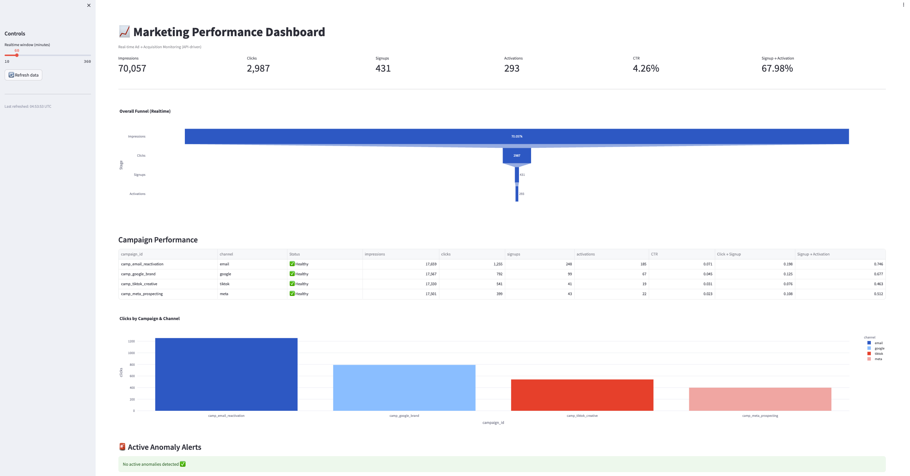
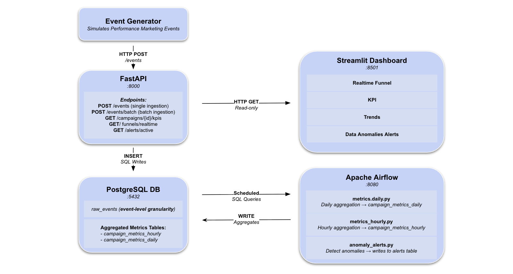

# Real-Time Marketing Performance Pipeline

An end-to-end, containerized marketing analytics platform that simulates real-time ad events, ingests them via an API, aggregates metrics using Airflow, and presents business-facing insights through an interactive dashboard.

This project mirrors how growth and performance marketing teams monitor campaigns in production.


## What This Project Does

- Simulates **real-time marketing events** (impressions, clicks, signups, activations)
- Ingests events through a **FastAPI** service with strict validation
- Stores raw data in **PostgreSQL**
- Aggregates campaign metrics using **Apache Airflow**
- Exposes KPI endpoints for analytics consumption
- Visualizes performance in a **Streamlit dashboard** designed for marketers


## Business Problem

Marketing teams need to:
- Monitor campaign performance **in near real time**
- Detect drops in CTR or conversion rates
- Compare campaigns and channels
- Understand the full **ad → acquisition funnel**

This system replicates that workflow end-to-end.


## System Architecture



## Tech Stack

| Layer | Technology |
|-----|------------|
| Event Simulation | Python |
| API | FastAPI |
| Database | PostgreSQL |
| Orchestration | Apache Airflow |
| Dashboard | Streamlit |
| Visualization | Plotly |
| Containerization | Docker & Docker Compose |


## Repository Structure
```
perf-mktg-dash/
├── api/
│   ├── main.py            # FastAPI application that validates and ingests marketing events into the database.
│   ├── requirements.txt   # Python dependencies for the FastAPI service.
│   └── Dockerfile         # Dockerfile to containerize the FastAPI service.
│
├── generator/
│   ├── generator.py       # Script to simulate real-time marketing events (e.g., impressions, clicks, signups).
│   ├── requirements.txt   # Python dependencies for the event generator.
│   └── Dockerfile         # Dockerfile to containerize the event generator.
│
├── dashboard/
│   ├── app.py             # Streamlit application for visualizing campaign performance and metrics.
│   ├── api_client.py      # Helper module to fetch data from the FastAPI service for the dashboard.
│   ├── requirements.txt   # Python dependencies for the Streamlit dashboard.
│   └── Dockerfile         # Dockerfile to containerize the Streamlit dashboard.
│
├── airflow/
│   ├── dags/
│   │   ├── metrics_hourly.py   # Airflow DAG to aggregate raw events into hourly campaign metrics.
│   │   ├── metrics_daily.py    # Airflow DAG to aggregate hourly metrics into daily campaign metrics.
│   │   └── anomaly_alerts.py   # Airflow DAG to detect anomalies in campaign performance metrics.
│   ├── requirements.txt        # Python dependencies for the Airflow service.
│   └── Dockerfile              # Dockerfile to containerize the Airflow service.
│
├── db/
│   └── init.sql            # SQL script to initialize the database schema (tables, constraints, etc.).
│
├── docker-compose.yml       # Docker Compose configuration to orchestrate all services (API, Airflow, DB, etc.).
├── .env                     # Environment variables for configuring the services (e.g., database credentials).
└── README.md                # Documentation for the project, including setup instructions and system overview.
```

## Database Design

### Raw Events Table

Stores event-level data for flexibility and replayability.

```sql
raw_events (
  event_id TEXT PRIMARY KEY,
  ts TIMESTAMP,
  user_id TEXT,
  campaign_id TEXT,
  channel TEXT,
  event_type TEXT,
  cost DECIMAL
)
```

### Hourly/Daily Aggregated Metrics
Used for fast dashboard queries and reporting.

```sql
campaign_metrics/hourly_daily (
  campaign_id TEXT,
  channel TEXT,
  day DATE,
  impressions INT,
  clicks INT,
  signups INT,
  activations INT,
  ctr DECIMAL,
  click_to_signup DECIMAL,
  signup_to_activation DECIMAL,
  total_cost DECIMAL,
  PRIMARY KEY (campaign_id, channel, day)
)
```

## Data Flow

#### 1. Generator
- Simulates realistic marketing funnels
- Sends validated events to the API

#### 2. FastAPI
- Validates payloads with Pydantic
- Writes events to PostgreSQL
- Serves KPI endpoints

#### 3. Airflow
- Runs scheduled aggregation DAGs
- Transforms raw events into daily metrics

#### 4.Dashboard
- Calls API endpoints
- Displays real-time and historical KPIs
- Designed for non-technical marketing users

## Dashboard Features
- KPI summary cards
- Funnel metrics (impression → activation)
- Conversion rates (CTR, CVR)
- Campaign and channel comparisons
- Realtime time-window controls
- Clean, executive-ready UI

## How to Run
#### 1. Start the services
```docker compose up --build```
#### 2. Access the services
- Dashboard: http://localhost:8501
- API: http://localhost:8000
- Airflow: http://localhost:8080


## Example API Endpoints
```http
GET /health
GET /funnels/realtime?minutes=60
GET /campaigns/{campaign_id}/kpis
GET /alerts/active
```

